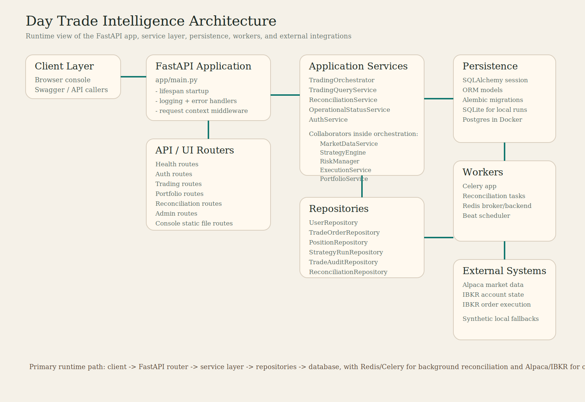
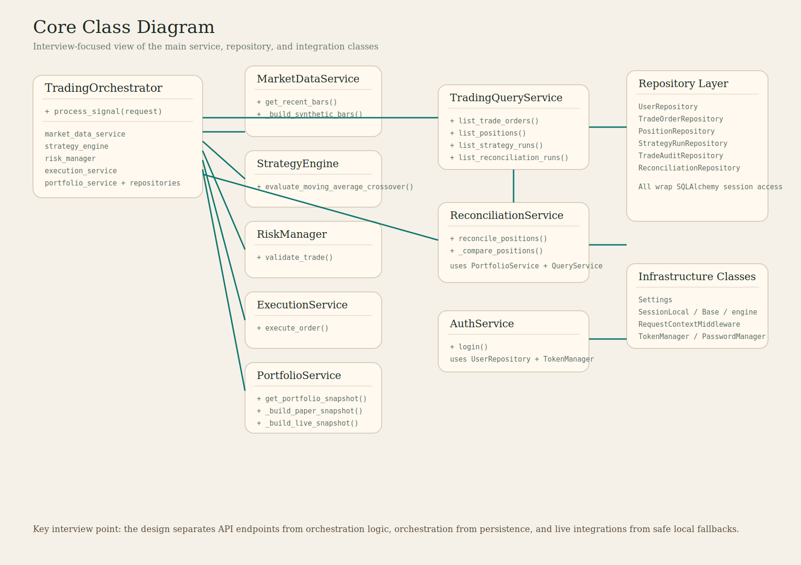

# Architecture Interview Guide

This document explains the project the way you would present it in an interview: what it is, how the pieces fit together, why the design choices make sense, and what trade-offs are built into the current implementation.

## 1. One-sentence system summary

Day Trade Intelligence is a FastAPI-based trading control plane that separates read APIs, write orchestration, authentication, persistence, and background reconciliation so the platform can support both safe local demos and live broker integrations.

## 2. How to explain the system in an interview

A strong short explanation would be:

"This project is a backend trading platform scaffold. FastAPI handles the HTTP layer, a service layer owns business logic, repositories isolate database access, and Celery handles asynchronous reconciliation work. For live integrations it is wired for Alpaca market data and IBKR portfolio or execution, but for development it can fall back to synthetic paper data so the product stays testable and demoable."

## 3. High-level architecture

The app is organized into a few clear layers:

1. Presentation layer
   FastAPI routes and the built-in operator console live here.
2. Application layer
   Services coordinate workflows such as auth, trade orchestration, queries, reconciliation, and operational status.
3. Domain / DTO layer
   Pydantic models define the request and response contracts used across routes and services.
4. Persistence layer
   SQLAlchemy models and repositories manage durable state.
5. Infrastructure layer
   Settings, DB sessions, logging, middleware, security helpers, Alembic, Celery, Docker, and external SDK integrations live here.

The biggest design strength is that these layers are separated enough that you can reason about them independently.

## 4. Main runtime flows

### Login flow

1. The console calls `POST /api/v1/auth/login`.
2. `AuthService` uses `UserRepository` to find the local user.
3. Password verification succeeds or fails.
4. On success, `TokenManager` signs a bearer token.
5. The browser stores the token and uses it for protected routes.

How to explain the design:
- Authentication is token-first.
- There is also API-key fallback for local compatibility.
- Role enforcement is centralized through `require_role(...)` instead of copied into each route body.

### Trading signal flow

1. `POST /api/v1/trading/signal` enters the trading router.
2. The router constructs a `TradingOrchestrator` through dependency wiring.
3. The orchestrator loads a portfolio snapshot from `PortfolioService`.
4. It fetches recent bars from `MarketDataService`.
5. `StrategyEngine` calculates a moving-average crossover signal.
6. `RiskManager` validates position size and drawdown constraints.
7. `ExecutionService` either simulates or submits the order.
8. Repositories persist audit logs, strategy run history, order history, and updated positions.
9. A normalized `TradeSignalResponse` goes back to the client.

How to explain the design:
- This is a classic orchestrator pattern.
- The route stays thin while business logic remains testable.
- Each collaborator has one focused responsibility.

### Read/query flow

1. An operator calls a route like `/trading/orders` or `/trading/positions`.
2. The route creates a `TradingQueryService`.
3. The query service reads from repositories.
4. ORM rows are mapped into API response models.

How to explain the design:
- Read paths and write paths are separated.
- Query logic is intentionally different from orchestration logic.
- This reduces accidental coupling and makes reporting endpoints simpler.

### Reconciliation flow

1. The client calls `/reconciliation/run` or a background version.
2. `ReconciliationService` fetches internal positions through `TradingQueryService`.
3. It fetches broker or paper positions through `PortfolioService`.
4. It compares symbol by symbol.
5. It persists the result through `ReconciliationRepository`.
6. The response returns matched or mismatched symbols with detail.

How to explain the design:
- Reconciliation is treated as its own workflow, not a side effect hidden inside trading.
- That is useful for auditability and operations.
- It also fits a background-worker model cleanly.

## 5. Core components explained

## FastAPI application

Files:
- [app/main.py](/c:/Users/rkafl/Documents/Projects/day_trade_intelligence/app/main.py)
- [app/api/router.py](/c:/Users/rkafl/Documents/Projects/day_trade_intelligence/app/api/router.py)
- [app/ui/router.py](/c:/Users/rkafl/Documents/Projects/day_trade_intelligence/app/ui/router.py)

Responsibilities:
- create the FastAPI app
- configure logging and exception handlers
- attach middleware
- run startup bootstrap and seeding
- mount API routes and the built-in console

Why this is good:
- the app entrypoint is small and focused
- startup concerns are isolated in lifespan logic
- route composition is centralized and readable

## TradingOrchestrator

File:
- [app/services/orchestrator.py](/c:/Users/rkafl/Documents/Projects/day_trade_intelligence/app/services/orchestrator.py)

Responsibilities:
- coordinate the full trade lifecycle
- record audit events
- persist trade and strategy records
- combine market data, strategy, risk, portfolio, and execution into one workflow

Why it exists:
- without this class, route handlers would become large and fragile
- it creates one testable unit for the write path
- it makes side effects explicit

Interview framing:
- "I used an orchestration service because the trade workflow spans multiple dependencies and side effects. The orchestrator keeps the route thin and makes the business flow testable as a unit."

## MarketDataService

File:
- [app/services/market_data_service.py](/c:/Users/rkafl/Documents/Projects/day_trade_intelligence/app/services/market_data_service.py)

Responsibilities:
- fetch bars from Alpaca in live configurations
- provide synthetic bars in local or development mode when credentials are missing
- normalize provider data into internal bar models

Why this is good:
- external provider logic is isolated behind one adapter
- the app is demoable without external credentials
- internal services do not depend on Alpaca SDK types directly

Trade-off:
- synthetic bars make development smoother, but they are not a substitute for real market data validation

## StrategyEngine

File:
- [app/services/strategy_engine.py](/c:/Users/rkafl/Documents/Projects/day_trade_intelligence/app/services/strategy_engine.py)

Responsibilities:
- evaluate moving-average crossover signals
- return a structured `StrategyDecision`

Why this is good:
- the strategy is deterministic and easy to test
- the service is small enough to be replaced with more advanced strategies later

Interview framing:
- "I kept strategy evaluation deterministic and side-effect free. That makes it easy to test and easier to replace later with additional strategy implementations."

## RiskManager

File:
- [app/services/risk_manager.py](/c:/Users/rkafl/Documents/Projects/day_trade_intelligence/app/services/risk_manager.py)

Responsibilities:
- reject HOLD decisions
- cap capital-at-risk
- enforce drawdown thresholds

Why this is good:
- risk rules are centralized instead of hidden inside the route or execution code
- policy is settings-driven
- failures produce meaningful domain errors

## ExecutionService

File:
- [app/services/execution_service.py](/c:/Users/rkafl/Documents/Projects/day_trade_intelligence/app/services/execution_service.py)

Responsibilities:
- simulate execution for dry runs
- submit live orders to IBKR when enabled
- wrap broker SDK exceptions in domain errors

Why this is good:
- the system can run safely in development
- broker integration details are isolated to one adapter
- the rest of the app does not know how IBKR orders are placed

## PortfolioService

File:
- [app/services/portfolio_service.py](/c:/Users/rkafl/Documents/Projects/day_trade_intelligence/app/services/portfolio_service.py)

Responsibilities:
- return synthetic paper snapshots for safe local use
- return live IBKR-backed account state when requested
- normalize account data into a consistent portfolio model

Why this is good:
- read models stay stable regardless of source
- risk and reconciliation work against a single normalized contract

## TradingQueryService

File:
- [app/services/query_service.py](/c:/Users/rkafl/Documents/Projects/day_trade_intelligence/app/services/query_service.py)

Responsibilities:
- provide read-only projections over persisted data
- convert ORM entities into API response models

Why this is good:
- it separates read concerns from the trade write workflow
- it makes endpoints like orders, positions, runs, and audit logs simple and consistent

## ReconciliationService

File:
- [app/services/reconciliation_service.py](/c:/Users/rkafl/Documents/Projects/day_trade_intelligence/app/services/reconciliation_service.py)

Responsibilities:
- compare internal positions against broker or paper positions
- persist reconciliation runs
- expose match and mismatch details

Why this is good:
- reconciliation is a first-class operation
- historical runs are preserved for review
- background execution becomes easy through Celery

## Repositories

Folder:
- [app/repositories](/c:/Users/rkafl/Documents/Projects/day_trade_intelligence/app/repositories)

Responsibilities:
- isolate SQLAlchemy access behind per-aggregate repositories
- handle create/list/upsert operations for core records

Why this is good:
- the service layer does not need raw session queries everywhere
- database operations are grouped by record type
- future refactors can change query details in one place

## Security layer

Files:
- [app/security/auth.py](/c:/Users/rkafl/Documents/Projects/day_trade_intelligence/app/security/auth.py)
- [app/security/tokens.py](/c:/Users/rkafl/Documents/Projects/day_trade_intelligence/app/security/tokens.py)

Responsibilities:
- decode bearer tokens
- map API keys to roles for local fallback
- enforce role-based access
- hash and verify passwords

Why this is good:
- route protection is declarative through FastAPI dependencies
- role checks are centralized and reusable

## Bootstrap and startup

File:
- [app/bootstrap.py](/c:/Users/rkafl/Documents/Projects/day_trade_intelligence/app/bootstrap.py)

Responsibilities:
- run migrations or metadata bootstrap
- seed local users and sample demo data

Why this is good:
- the app becomes usable quickly in local environments
- demo state is reproducible
- startup policy is explicit in configuration

## Background workers

Files:
- [app/workers/celery_app.py](/c:/Users/rkafl/Documents/Projects/day_trade_intelligence/app/workers/celery_app.py)
- [app/workers/reconciliation_tasks.py](/c:/Users/rkafl/Documents/Projects/day_trade_intelligence/app/workers/reconciliation_tasks.py)

Responsibilities:
- host Celery worker configuration
- run reconciliation asynchronously
- support scheduling through beat

Why this is good:
- longer-running or recurring jobs do not need to block API requests
- the app is already structured for background operational tasks

## 6. Persistence model

Core persisted entities:
- `User`
- `TradeOrder`
- `Position`
- `StrategyRun`
- `TradeAuditLog`
- `ReconciliationRun`

How to explain it:
- Users support local auth.
- Orders, positions, runs, and audit logs create traceability around the trade lifecycle.
- Reconciliation runs preserve operational history.

A useful interview line:

"I persisted not just orders and positions, but also audit logs and strategy runs. That makes the system much more explainable operationally because you can reconstruct what happened, not just what the final state is."

## 7. Configuration model

File:
- [app/core/settings.py](/c:/Users/rkafl/Documents/Projects/day_trade_intelligence/app/core/settings.py)

The system is driven by typed settings for:
- API pathing
- broker credentials
- market-data credentials
- risk limits
- database and Redis URLs
- auth secrets
- bootstrap behavior

Why this is good:
- configuration is centralized
- startup errors happen early
- it is easier to move between local, Docker, and future production environments

## 8. Local demo strategy and why it matters

One of the most important architectural choices here is the use of local-safe fallbacks:
- paper portfolio snapshots instead of live account state
- dry-run execution instead of live order placement
- synthetic market bars in development when Alpaca credentials are missing
- seeded local users and demo records

Why this matters:
- developers can exercise the full product without external accounts
- tests stay deterministic
- demos do not depend on third-party uptime or credentials

Interview framing:
- "I intentionally added local fallbacks so the product stays operable and testable without external dependencies. That improves onboarding, CI stability, and demo reliability."

## 9. Strengths of the current design

1. Clear separation of concerns.
   Routes, services, repositories, and integrations are distinct.
2. Good testability.
   The orchestrator and services can be unit tested with fakes.
3. Safe local development path.
   The app is useful even without live credentials.
4. Operational visibility.
   Audit logs, strategy runs, and reconciliation history are persisted.
5. Extensible architecture.
   Strategy, broker, and market-data adapters can evolve independently.

## 10. Current limitations and honest trade-offs

1. The strategy layer is intentionally simple.
   Only a moving-average crossover rule is implemented.
2. Persistence is still fairly CRUD-oriented.
   There is no more advanced query optimization or CQRS split yet.
3. Auth is local-user based.
   There is no external identity provider integration.
4. The console is lightweight.
   It is practical, but not yet a full production operator dashboard.
5. Synthetic fallbacks are good for demos, but they can hide integration realities if overused.

A good interview answer here is to acknowledge that the project is a strong scaffold, not a finished production trading system.

## 11. Questions you are likely to get in an interview

### Why use an orchestrator instead of putting logic directly in routes?

Because the write path spans multiple dependencies, validations, and persistence steps. The orchestrator makes that workflow explicit, testable, and reusable while keeping route handlers thin.

### Why have separate query and write services?

Read paths and write paths evolve differently. Separating them keeps reporting logic simple and prevents write orchestration concerns from leaking into read endpoints.

### Why use repositories at all when SQLAlchemy already exists?

Repositories create a boundary between business logic and storage details. That makes the service layer cleaner and makes future changes to queries or storage patterns easier to localize.

### How does the system stay usable without external credentials?

It falls back to paper portfolio data, dry-run execution, and synthetic market bars in development. That keeps the system demoable and testable while still supporting live integrations when configured.

### What would you improve next?

1. Add filtering and pagination controls to the console UI.
2. Expand strategy support beyond one rule.
3. Add CI checks for Docker startup and console smoke flows.
4. Add richer audit trails around auth and admin operations.
5. Add production auth options and environment separation.

## 12. Best concise interview pitch

"This project is a trading backend scaffold built around clean service boundaries. FastAPI handles the transport layer, an orchestrator coordinates the write path, query services handle reporting reads, repositories isolate persistence, and Celery supports asynchronous reconciliation. The key architectural idea is that live integrations are abstracted behind services while local-safe fallbacks keep the system testable and demoable without external credentials."
