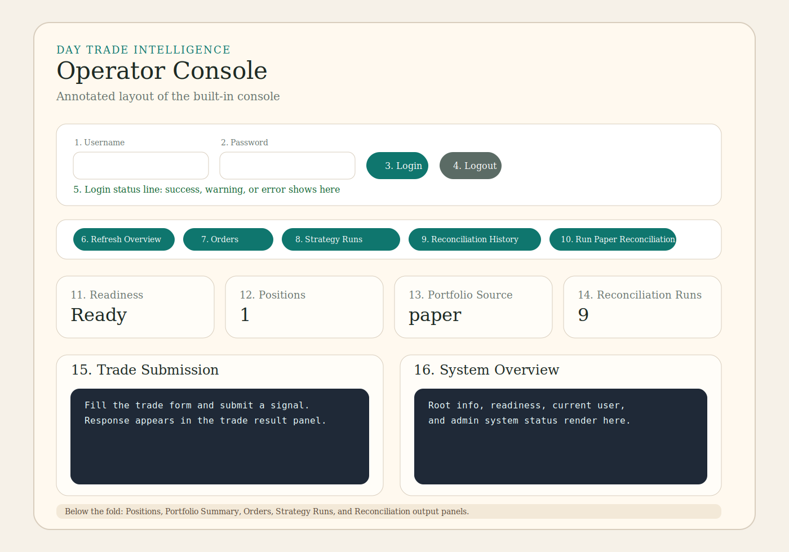
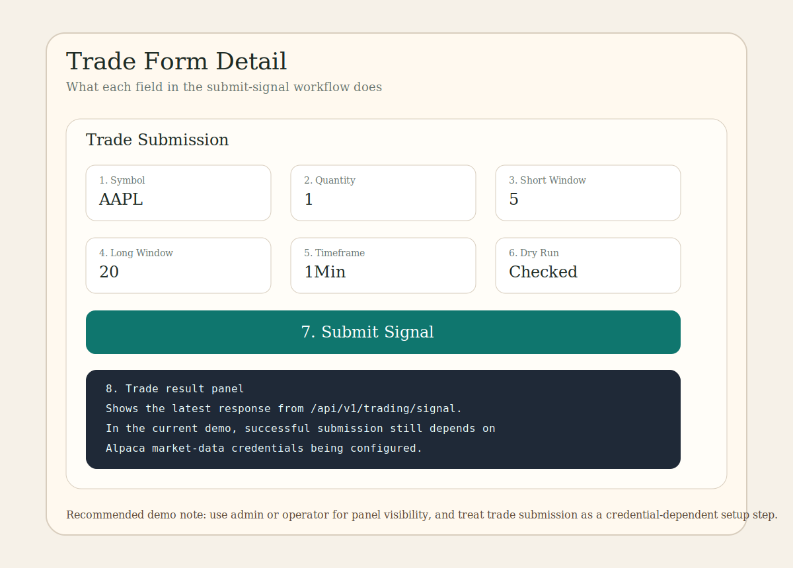

# User Guide

This manual walks through the built-in Day Trade Intelligence console from the first page load through the main operator workflows.

## 1. Start the app

### Docker

1. Start Docker Desktop.
2. From the project root, run `docker compose up -d --build`.
3. Open the console at `http://127.0.0.1:8001/console`.

### Local Python run

1. Create and activate a Python 3.11+ environment.
2. Install dependencies with `pip install -e .[dev]`.
3. Start the API with `powershell -ExecutionPolicy Bypass -File .\scripts\start-local.ps1`.
4. Open `http://127.0.0.1:8000/console`.

## 2. Default accounts and what they can do

| Account | Password | Main use | What works in the console |
| --- | --- | --- | --- |
| `admin` | `admin123` | Full demo access | Login, overview, readiness, positions, orders, strategy runs, portfolio, reconciliation, admin system status, dry-run trade submission |
| `operator` | `operator123` | Operations and monitoring | Login, overview, readiness, positions, orders, strategy runs, portfolio, reconciliation, dry-run trade submission |
| `trader` | `trader123` | Trade submission only | Login and trade submission route access; most monitoring panels remain restricted by design |

Notes:
- For the most complete demo, use `admin`.
- The current Docker demo runs with seeded sample data.
- In local or development mode, dry-run trade submission now falls back to synthetic market bars if Alpaca credentials are missing.
- Live market-data-backed behavior still requires real Alpaca credentials.

## 3. What each control does

### Login area

1. `Username`
   Enter `trader`, `operator`, or `admin`.
2. `Password`
   Enter the matching password. Pressing `Enter` also submits login.
3. `Login`
   Sends `POST /api/v1/auth/login`. On success, the console stores the bearer token in browser local storage and loads the protected data panels.
4. `Logout`
   Clears the saved bearer token and resets all protected panels back to a logged-out state.
5. Login status line
   Shows `Not logged in`, `Signing in`, a success message like `Logged in as admin`, or the actual API error if login fails.

### Quick action buttons

1. `Refresh Overview`
   Reloads the root info, readiness, current user, admin status, and portfolio summary.
2. `Load Orders`
   Reloads the order history panel.
3. `Load Strategy Runs`
   Reloads strategy evaluation history.
4. `Load Reconciliation History`
   Reloads reconciliation runs.
5. `Run Paper Reconciliation`
   Sends `POST /api/v1/reconciliation/run?live=false` and refreshes the reconciliation panels.

### Summary cards

1. `Readiness`
   Shows whether the app, database, and Redis are ready.
2. `Positions`
   Shows the count of positions returned by `GET /api/v1/trading/positions`.
3. `Portfolio Source`
   Shows whether the portfolio snapshot is `paper` or `live`.
4. `Reconciliation Runs`
   Shows the count of runs returned by `GET /api/v1/reconciliation/runs`.

### Trade Submission form

1. `Symbol`
   The ticker to evaluate, for example `AAPL`.
2. `Quantity`
   The number of shares for the requested order.
3. `Short Window`
   The short moving-average window used by the demo strategy.
4. `Long Window`
   The long moving-average window used by the demo strategy.
5. `Timeframe`
   The candle timeframe, for example `1Min`.
6. `Dry Run`
   When checked, the order stays simulated instead of being treated as a live submission.
7. `Submit Signal`
   Sends `POST /api/v1/trading/signal` and shows the orchestration result in the trade result panel.

### Data panels

1. `System Overview`
   Shows root info, readiness, current user, and admin status responses.
2. `Positions`
   Shows the internal position snapshot.
3. `Portfolio Summary`
   Shows account snapshot data. In the demo this is a paper portfolio.
4. `Orders`
   Shows persisted order history.
5. `Strategy Runs`
   Shows prior strategy evaluations.
6. `Reconciliation`
   Shows stored reconciliation results and the output of manual reconciliation runs.
7. `Trade Result`
   Shows the response from the most recent trade submission attempt.

## 4. First-time walkthrough from start to finish

### Recommended path: `admin`

1. Open `http://127.0.0.1:8001/console`.
2. Confirm the page loads and the top status line says `Not logged in`.
3. Enter `admin` in `Username`.
4. Enter `admin123` in `Password`.
5. Click `Login`.
6. Wait for the login status line to change to `Logged in as admin.`
7. Review the `System Overview` panel.
   You should see the app name, environment, readiness, current user, and admin status.
8. Review the summary cards.
   `Readiness` should show `Ready` in the Docker demo.
9. Review the `Positions`, `Orders`, and `Strategy Runs` panels.
   Seeded sample records should already be present.
10. Review `Portfolio Summary`.
    In the demo, this is a synthetic paper account snapshot.
11. Click `Load Reconciliation History`.
    You should see existing runs.
12. Click `Run Paper Reconciliation`.
    A new reconciliation result should appear in the reconciliation panel and history count.
13. Fill the trade form with the default values and click `Submit Signal`.
    In the local demo, dry-run submission works even without Alpaca credentials because the app falls back to synthetic bars.
14. Review `Trade Result`, `Orders`, and `Positions` again after the submission.
15. Click `Logout` when finished.

## 5. What you should expect to see

### Logged-out state

- The app can still show public root and readiness information.
- Protected panels display a message telling you to log in first.
- Protected actions are blocked until a bearer token exists.

### Logged-in admin state

- `System Overview` includes current user and admin system status.
- `Positions`, `Orders`, `Strategy Runs`, `Portfolio Summary`, and `Reconciliation` all load.
- Reconciliation actions work in the local demo.
- Dry-run trade submission works in the local demo.

### Logged-in operator state

- Almost everything except admin-only system status is available.
- This is the best role for day-to-day monitoring without admin-only access.

### Logged-in trader state

- Login succeeds.
- Operator and admin reporting panels return role errors by design.
- Trade submission works, but the surrounding monitoring panels remain restricted.

## 6. Current demo limitations

1. The console works best with `admin` or `operator` because most read panels require operator-level access.
2. Live market-data-backed behavior still requires real `ALPACA_API_KEY` and `ALPACA_SECRET_KEY` values.
3. The portfolio shown in the default demo is paper data, not a live brokerage account.
4. Reconciliation results in the demo may show mismatches because the internal seeded position and the synthetic broker snapshot do not match.

## 7. Useful URLs

- Console: `http://127.0.0.1:8001/console`
- API docs: `http://127.0.0.1:8001/docs`
- Health: `http://127.0.0.1:8001/api/v1/health`
- Readiness: `http://127.0.0.1:8001/api/v1/ready`

## 8. Troubleshooting

### The page opens but login seems to do nothing

- Check the login status line directly under the login buttons.
- If you still have an older tab open, hard refresh the page so the updated console JavaScript loads.
- Use `admin / admin123` for the clearest full-demo experience.

### Trade submission fails

- Confirm `Dry Run` is checked for local/demo usage.
- Live broker-style or live market-data setups still require real external credentials.
- Check the `Trade Result` panel for the exact API error message.

### The app does not load

- Verify Docker is running.
- Verify the API health endpoint returns `200` at `http://127.0.0.1:8001/api/v1/health`.
- Check container logs with `docker compose logs --tail 80 api`.
